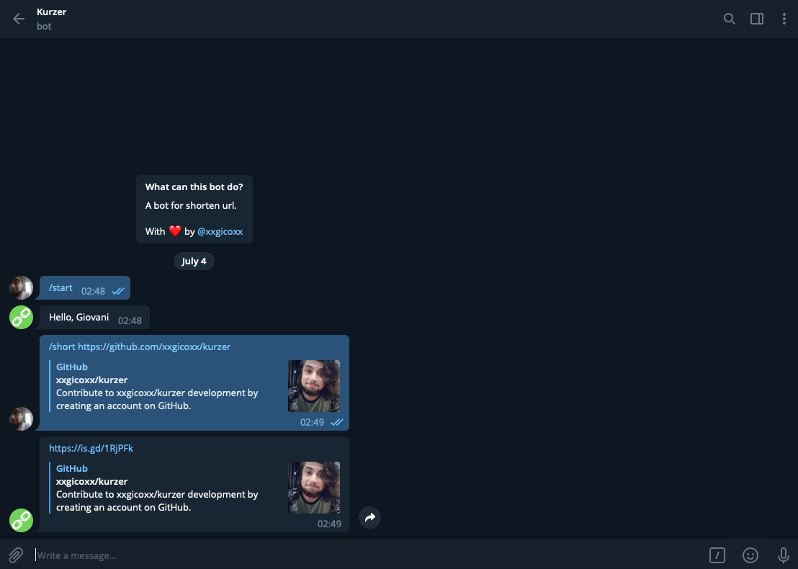

# Kurzer Bot
Telegram bot for shorten url.

<p align="center">
  
</p>

# Features
* /short `url` - Short url
* /help - Help

# Prerequisites
* [Node.js](https://nodejs.org/en/)

# Running
### 1. Configure
````
# Bot
Create and configure .env file like .env.example.
````

### 2. Telegram
````
# Create an Telegram bot
Find @BotFather on Telegram, type /newbot and follow the instructions.

# Username
Get your bot username and set 'TELEGRAM_USERNAME' in .env.

# Token
Get your token from @BotFather and set 'TELEGRAM_TOKEN' in .env.
````

### 3. Run
````
# Install dependencies
npm install

# Start
npm start
````

# Built With
* [Node.js](https://nodejs.org/en/)

# Authors
* [xxgicoxx](https://github.com/xxgicoxx/)

# Acknowledgments
* [FlatIcon](https://www.flaticon.com/)